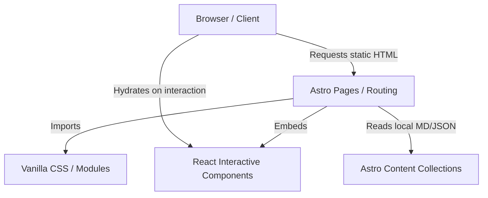

# Architecture Spine — narvaezdario_web_page

## Design Paradigm

**Component-Based SSG with Islands Architecture**
Astro actúa como el motor principal para generar HTML estático altamente optimizado en tiempo de compilación. Para los elementos interactivos limitados (como los acordeones del CV o el futuro Sandbox IA), los componentes de React se hidratan de forma independiente en el cliente ("Islands"). Este paradigma asegura tiempos de carga instantáneos (Lighthouse > 95) mientras retiene la capacidad de inyectar características dinámicas de forma selectiva.

## Invariants & Rules



### AD-1 — Manejo de Estilos

- **Binds:** Toda la capa de estilización del proyecto.
- **Prevents:** Acoplamiento a frameworks utilitarios (Tailwind) y bloqueos en la personalización del diseño "premium".
- **Rule:** Se utilizará Vanilla CSS con variables HSL nativas y CSS Modules. Todo el diseño y las animaciones deben implementarse mediante hojas de estilo estándar para maximizar el control estético y el rendimiento sin dependencias pesadas.

### AD-2 — Interactividad (Islands Architecture)

- **Binds:** Todos los componentes con interactividad en el cliente (Client-side JavaScript).
- **Prevents:** Fragmentación de librerías JS o limitaciones si los componentes requieren escalar en complejidad en el futuro.
- **Rule:** Se utilizará React de manera exclusiva para los componentes interactivos en las "islas" de Astro. Estos deben ser montados usando directivas como `client:load` o `client:visible` únicamente donde la interactividad sea estrictamente necesaria (0 JavaScript extra por defecto).

### AD-3 — Capa de Datos

- **Binds:** Gestión de contenido del blog y datos estáticos del portafolio.
- **Prevents:** Dependencia de servicios externos (Headless CMS), latencia de red durante la compilación, y falta de tipado estricto en los datos.
- **Rule:** El contenido será gestionado de manera local mediante "Astro Content Collections", usando archivos Markdown/MDX y JSON almacenados en el repositorio.

### AD-4 — Despliegue y Entornos

- **Binds:** Toda la infraestructura de producción y el flujo CI/CD.
- **Prevents:** Uso de plataformas externas dispersas y despliegues manuales propensos a errores.
- **Rule:** El proyecto se desplegará en GitHub Pages utilizando un flujo de integración continua automatizado mediante GitHub Actions, consolidando el código y el alojamiento.

## Consistency Conventions

| Concern             | Convention                                                                                                      |
| ------------------- | --------------------------------------------------------------------------------------------------------------- |
| Enrutamiento        | Basado en archivos usando el directorio `src/pages/` nativo de Astro.                                           |
| Estructura de Datos | Validada rígidamente a través de esquemas Zod integrados con Astro Content Collections.                         |
| Tipado              | Uso obligatorio y estricto de TypeScript en todo el proyecto (`strict: true`).                                  |
| Calidad de Código   | Formateo con Prettier y linting con ESLint integrados para mantener el repositorio presentable como portafolio. |

## Stack

| Name       | Version               |
| ---------- | --------------------- |
| Astro      | 4.x (o más reciente)  |
| React      | 18.x (o más reciente) |
| TypeScript | 5.x                   |
| Node.js    | >= 20                 |

## Structural Seed

```text
narvaezdario_web_page/
  src/
    components/      # Componentes UI reutilizables (Astro y React)
    content/         # Astro Content Collections (Blog posts, data JSON)
    layouts/         # Envoltorios de diseño para consistencia
    pages/           # Enrutamiento basado en archivos
    styles/          # Archivos Vanilla CSS globales y sistema de variables HSL
  public/            # Assets estáticos (imágenes, favicons)
```

## Deferred

- **Estado Global:** Dado que la interactividad en la Fase 1.0 es mínima y aislada, se pospone la decisión de implementar un manejador de estado global (como Zustand o Nano Stores) hasta la Fase 1.1, momento en que el "Sandbox IA" requiera comunicación compleja entre componentes.
- **Métricas y Analítica:** La configuración de analítica exhaustiva se pospone temporalmente en favor de lograr un despliegue súper rápido de los contenidos principales.
